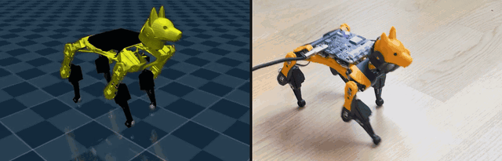

# BittleJuice — reinforcement learning on a Petoi Bittle X

A complete pipeline for training a walking policy in MuJoCo and running it on a real
[Petoi Bittle X](https://www.petoi.com/) at 50 Hz: the simulation, the measured plant model,
the firmware patches that make the robot fast enough to close a loop around, and a separate runtime.

A trained policy ships with the repo, so you can go from a boxed robot to a walking one
without training anything — and you can watch that policy walk in simulation in about three
minutes, with no robot at all.



*One policy, one 0.10 m/s command, both sides: the gait it was trained to walk in
simulation, and that same policy closing the loop on the robot at 50 Hz.*

## Watch it walk first (no robot needed)

```bash
git clone --recurse-submodules https://github.com/mike-grayhat/bittlejuice
cd bittlejuice
curl -LsSf https://astral.sh/uv/install.sh | sh     # if you do not have uv
uv sync

# the shipped policy, in the simulator it was trained in
uv run python sim/mj_eval.py -e shipped --video gait.mp4    # headless, works over SSH
uv run mjpython sim/mj_eval.py -e shipped                   # interactive viewer
```

(Use `mjpython` for the interactive viewer on macOS — it ships with the mujoco wheel and is
already in `.venv/bin`. On Linux, plain `python` opens the viewer.)

That is the exact policy in `deploy/policy/`, running through the exact observation pipeline,
action latency and actuator model it was trained against. It walks at 0.097 m/s against a
commanded 0.100.

Two more commands worth running before you own a robot:

```bash
uv run pytest                                       # the invariants, ~10 s
uv run python tools/mj_deployability.py -e shipped  # will this gait survive real servos?
```

The second one is the gate that decides whether a policy transfers at all. The shipped policy
reads 2.6% slew saturation against a 15% threshold — see [docs/training.md](docs/training.md)
for why that number, and not the reward curve, is the one that matters.

## Ways in, in increasing order of effort

| | you get | you need | roughly |
|---|---|---|---|
| **0. Watch the shipped policy** | a gait in the viewer | a laptop | 3 minutes |
| **1. Run it on a robot** | a walking robot | a Bittle X v2, a USB cable, a firmware flash | an evening |
| **2. Train your own** | your own gait | the above, plus a decent CPU | +5 hours |
| **3. Measure your own robot** | a plant model fitted to *your* hardware | the above, plus patience | +a day |

---

## What you are working with

Three properties of this robot drive nearly every design decision. They are worth reading
before anything else, because most of what looks strange in this codebase follows from them.

**It cannot read its joint positions.** The firmware can infer one — it detaches the servo,
turns the signal pin into an input, and times a reply pulse — at roughly **20 ms a joint**,
with the leg limp for the duration. A whole-body read comes back at a measured **9 Hz**,
against a loop that gets 20 ms per tick. So `dof_pos` and `dof_vel` are never measured. They
are *estimated*, by replaying the host's own commanded targets through a model of the servo's
measured response — and the simulator observes the same estimate rather than its own ground
truth, so the policy sees the same thing in both places.

**It has no raw gyro.** The firmware never prints angular rates; they are finite-differenced
from the fused attitude stream, and that differentiation sets the noise floor.

**Its servos are slow**, and a naive MuJoCo actuator is much faster. Both stages have to be
fitted together or the same lag gets counted twice.

The consequence is that the interesting work is in the plant model, not the algorithm. The
RL is ordinary PPO.

---

## Running it on a robot

**What this was built against.** The measured plant model, the fitted servo response and the
shipped policy all come from a **Bittle X v2 with the alloy-geared servos**. That is not
incidental. The servo model *is* what the policy was really trained against, so a robot with
different actuators is a different plant: the lighter plastic-geared servos and earlier Bittle
revisions have their own torque and slew behaviour, and the shipped policy may walk poorly or
not at all on them. Nothing stops you trying — but read a bad gait as a plant mismatch rather
than a bad policy, and refit against your own hardware with
[docs/measuring.md](docs/measuring.md).

**1. Flash the firmware.** Stock firmware cannot run this control loop — it ramps every pose
command and caps the IMU at 5 Hz. The patches add a **runtime mode** that is off at boot, so
a flashed robot still walks, dances and answers the app exactly as before until something asks.
Full instructions, including which robots the prebuilt image fits:
**[docs/firmware.md](docs/firmware.md)**.

**2. Bring it up in stages, off the ground first.** The order matters and every stage is a
gate. Full detail in [deploy/README.md](deploy/README.md).

```bash
export PORT=/dev/ttyUSB0                        # or /dev/cu.usbmodem* on macOS
POLICY=policy/bittle_policy_best_0944.npz

# a. does it talk, can it switch modes, and is the IMU stream at 250 Hz once it has?
uv run --directory deploy python -m bittle_io --port $PORT --run-id bringup probe

# b. the policy, with no serial writes at all
uv run python deploy/control_loop.py --port $PORT --policy $POLICY --dry-run

# c. robot SUSPENDED, legs free: hold the stance pose only
uv run python deploy/control_loop.py --port $PORT --policy $POLICY --hold

# d. still suspended: the real policy, short run
uv run python deploy/control_loop.py --port $PORT --policy $POLICY \
    --command 0.10 0 0 --duration 5

# e. on the floor, spotted by hand the first time
uv run python deploy/control_loop.py --port $PORT --policy $POLICY \
    --command 0.10 0 0 --duration 10
```

`deploy/` deliberately depends on nothing but `numpy` and `pyserial` — no torch, no mujoco —
so it runs on limited hardware like a Pi. Copy that one directory to the robot. If you only
ever want to *run* a policy and never train one, that is also your whole install:

```bash
cd deploy && pip install -e .        # numpy + pyserial, no torch, no mujoco
```

The shipped policy walks at 0.097 m/s and survives 12 mm rough terrain in sim without
falling. It was trained at a **fixed 0.10 m/s** and the export carries that range, so any
other `--command` is clamped and the loop says so on stdout.

---

## Where things are

```
sim/            training pipeline: config, plant, PPO entrypoints, policy export
configs/        the training recipes -- an objective extending a shared base
deploy/         robot runtime -- numpy + pyserial only
  bittle_io/    the measured serial layer and the hardware characterization suite
  policy/       exported policies the robot can run
tools/          diagnostics, one script per question
tests/          invariants, asserted against sim/config.py
model/          bittle.xml + meshes
logs/shipped/   the checkpoint behind the shipped policy, so sim eval works on a fresh clone
firmware/       submodule: the OpenCat fork, pinned to the patched branch
measurements/   hardware captures; reference/ is a complete patched-firmware session
docs/           the long-form guides below
```

| if you want to | read |
|---|---|
| flash the robot | [docs/firmware.md](docs/firmware.md) |
| train your own policy | [docs/training.md](docs/training.md) |
| fit the sim to your own hardware | [docs/measuring.md](docs/measuring.md) |
| re-flash and re-verify after a firmware change | [docs/reflashing.md](docs/reflashing.md) |
| work on the voice module itself | [docs/voice.md](docs/voice.md) |
| understand the robot runtime | [deploy/README.md](deploy/README.md) |
| understand the measurement instrument | [deploy/bittle_io/README.md](deploy/bittle_io/README.md) |
| know which measured numbers are safe to use | [measurements/README.md](measurements/README.md) |
| get background on servos, IMUs, system ID | [deploy/bittle_io/READING.md](deploy/bittle_io/READING.md) |

## How the sim is kept honest

The tests are not unit tests in the usual sense. They pin the places where sim and hardware
can silently disagree, and most of them exist because that disagreement actually happened:

- `test_actuator_dynamics.py` — the fitted servo response, and that the composed
  filter+actuator matches the measured step response rather than double-counting it
- `test_servo_observation.py` — sim's `dof_pos`/`dof_vel` estimate agrees bit for bit with
  what the deploy loop computes
- `test_reward_support.py` — every reward term still has usable gradient under the
  disturbances the environment actually applies
- `test_joint_mapping_vs_opencat.py` — joint index and sign against Petoi's own table
- `test_latency_paths.py` — the observation gets `a_t` while the plant gets `a_{t-k}`
- `test_realtime_mode.py` — the control loop refuses to run against firmware that cannot
  switch into realtime mode, rather than silently walking badly and reading a dead IMU

Run them before believing anything: `uv run pytest`.

## Licence and credit

This repository is MIT licensed — see [LICENSE](LICENSE).

The `firmware/` submodule is a fork of
[Petoi's OpenCatESP32](https://github.com/PetoiCamp/OpenCatEsp32-Quadruped-Robot) (MIT,
© Rongzhong Li), pinned to a branch carrying the patches described in
[docs/firmware.md](docs/firmware.md). To regenerate that patch against a different upstream:
`git -C firmware diff $(git -C firmware merge-base HEAD origin/main) HEAD`.

The terrain curriculum follows Rudin et al. ([arXiv:2109.11978](https://arxiv.org/abs/2109.11978));
the mirror-symmetry loss follows Yu et al. ([arXiv:1801.08093](https://arxiv.org/abs/1801.08093)).
Training uses [rsl_rl](https://github.com/leggedrobotics/rsl_rl).
